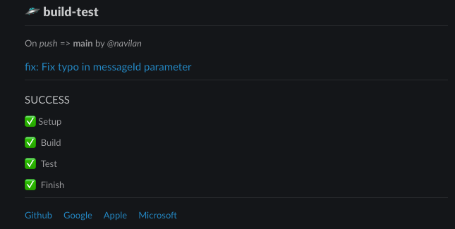

# Slack Action Status

A Github Action Slack Notifier:

* that can use Slack Block Kit for messages...
* which provides a way to customize the notification message with templates...
* that can possibly make build notifications look pretty...pretty...good

## Usage

```yaml
uses: navilan\slack-action-status@v2
with:
  githubToken: ${{ secrets.GITHUB_TOKEN }}
  botToken: "testBotToken"
  channelId: "testChannelId"
  templateFile: .github/workflows/slack-blocks.json.eta
  status: "Testing Action"
  inclusionSuffix: "!!" 
  indicators: |
    - completed: ":white_check_mark:"
    - running: ":hourglass:"
    - queued: ":double_vertical_bar:"
    - unclear: ":grey_question:"
    - failed: ":x:"
    - cancelled: ":octogonal_sign:"
    - skipped: ":large_green_square:"
```

## Parameters

* **githubToken** (Required)

    `${{ secrets.GITHUB_TOKEN }}`. This is used to get the running jobs and steps from the octokit API.

* **botToken** (Required)

   [Slack documentation](https://api.slack.com/authentication/token-types#bot) on how to setup your app and get the bot token.

---

* **channelId** (Required)

    You can get the channel id by clicking the chevron on the channel header.

    

---

* **templateFile** (Optional)

   You can use [slack block kit](https://api.slack.com/block-kit) to create a message template. [eta template engine](https://eta.js.org/) in its default configuration is used to generate the message. [These variables](#vars) are available in the `it` context of the template.

   View the [template used by this repository](.github/workflows/slack-blocks.json.eta).

   If the template file is not provided, the `status` parameter is used
   as plain text message.

   

---

* **status** (Required)

   Current status.

---

* **params** (Optional)

    A list of key, value pairs to feed the template.

    ```yaml
    params: |
      - key1: value1
      - key2: value2
    ```

    _Note the pipe that makes it a string value_

---

* **indicators** (Optional)

   Key value pairs of indicators - plain text or slack emoji as status prefixes for jobs and steps

   ```yaml
    indicators: |
        - completed: ":white_check_mark:"
        - inProgress: ":hourglass:"
    ```

    _Note the pipe that makes it a string value_

---

* **inclusionSuffix** (Optional)

    Steps that have a name suffixed with this pattern are included in the Slack notification message. Default: All steps are shown.

---

* **messageId** (Optional)

    A slack message that needs to be updated. If this is not provided, a new message is created.

---

* **forceSuccess** (Optional)

    Forces the current job status to be a success regardless of the API result. This can be used in the
    final action to indicate workflow completion.

    **Important**: If you are using this parameter, ensure that you do not give your job a descriptive name.

* **forceFailure** (Optional)

    Forces the current job status to be a failure regardless of the API result. This can be used in the
    final action to indicate workflow completion.

    **Important**: If you are using this parameter, ensure that you do not give your job a descriptive name.

## Template Context Variables {#vars}

The context variables are well typed. They can be accessed through the default template root variable `it`.

You can see the type definition here:
[Template Variables Typescript definition](./src/types.d.ts)

## Thank You

* [voxmedia](https://github.com/voxmedia/github-action-slack-notify-build)
